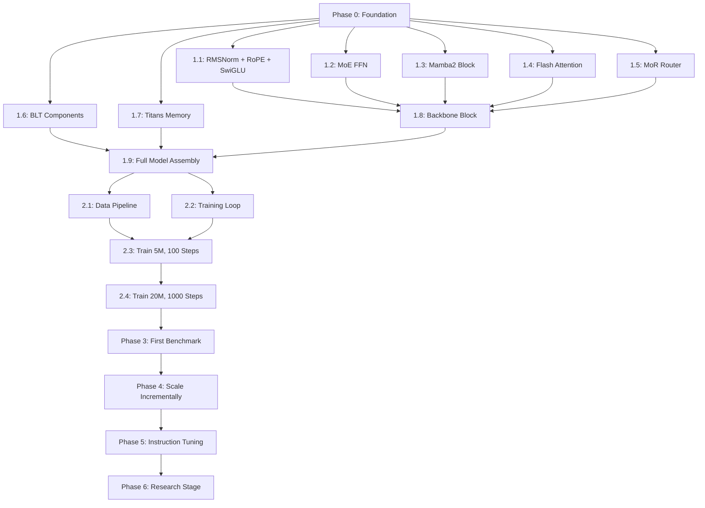

# IVERI CORE — Phase Dependency Graph

> This document defines the dependency relationships between all implementation
> phases and steps. Before starting any phase or step, verify that all
> dependencies have successfully passed their exit gates.

## Graph

## Dependency Table

| Step | Depends On | Description |
|------|-----------|-------------|
| **Phase 0** | — | Foundation & Infrastructure |
| **1.1** | Phase 0 | RMSNorm, RoPE, SwiGLU |
| **1.2** | Phase 0 | MoE Router + Expert FFNs |
| **1.3** | Phase 0 | Mamba2 SSM Block |
| **1.4** | Phase 0 | Flash Attention Wrapper |
| **1.5** | Phase 0 | MoR Router + Recursion Engine |
| **1.6** | Phase 0 | BLT Entropy Model, Patcher, Encoder, Decoder |
| **1.7** | Phase 0 | Titans Memory, Updater, LR Generator |
| **1.8** | 1.1, 1.2, 1.3, 1.4, 1.5 | Backbone Block Assembly |
| **1.9** | 1.6, 1.7, 1.8 | Full Model Assembly |
| **2.1** | 1.9 | Data Pipeline (TinyStories) |
| **2.2** | 1.9 | Training Loop |
| **2.3** | 2.1, 2.2 | Train 5M Model, 100 Steps |
| **2.4** | 2.3 | Train 20M Model, 1000 Steps |
| **Phase 3** | 2.4 | First Benchmark vs Baselines |
| **Phase 4** | Phase 3 | Scale to 50M, 123M |
| **Phase 5** | Phase 4 | Instruction Tuning + Chat |
| **Phase 6** | Phase 5 | Research Publications + Patents |

## Rules

1. **Never skip dependencies.** Every dependency must have passed its exit gate.
2. **Steps within Phase 1 (1.1–1.7)** can be built in parallel — they only depend on Phase 0.
3. **Step 1.8** is the first integration point — it requires 1.1 through 1.5.
4. **Step 1.9** is the full integration — it requires everything in Phase 1.
5. **Phase 2** cannot begin until 1.9 passes its sanity check.
